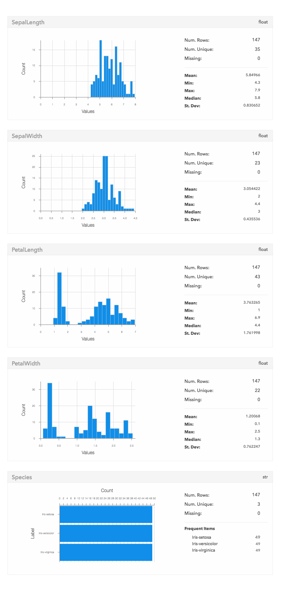
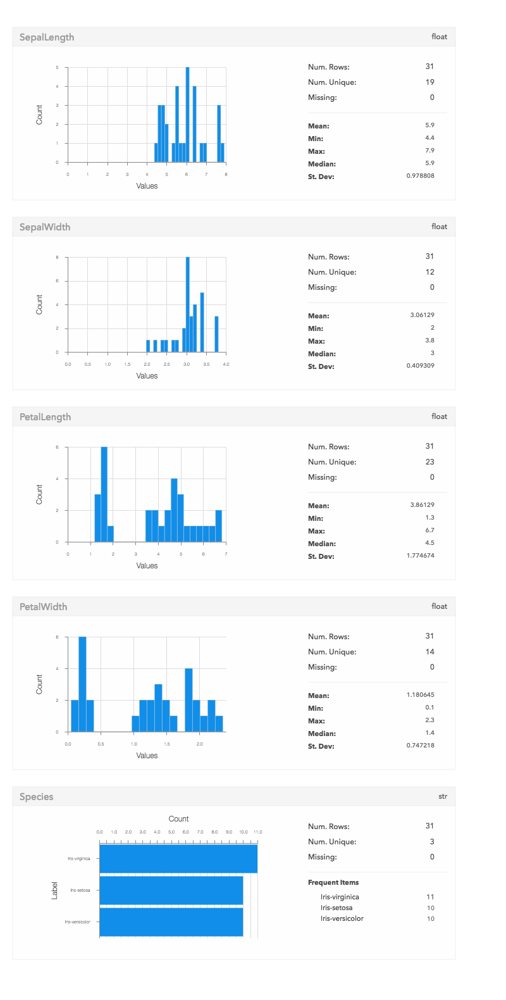
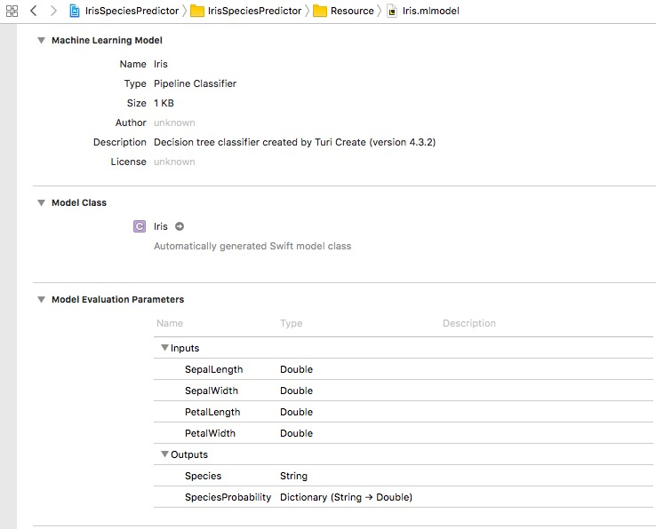

# Iris Species Predictor

>
* Train a decision tree classifier model with Turi Create. Use the data to predicte the iris's species.
* Add a iris model to an app, pass input data to the model, and process the model's predictions.

## Requirements

* Xcode 9.0 or later
* iOS 11.0 or later
* Turi Create 4.3
* Python 2.7.10
* Jupyter notebook 5.5.0

## Packing List

The sample contains the following items:

* `README.md` - This file.
* `LICENSE` - The standard sample code license.
* `IrisSpeciesPredictor` - An Xcode project for the program.
* `ml` - A directory containing iris datasets (.csv files, train data and test data), a decision tree classifier model (Iris.model), a core ml model (Iris.mlmodel), a python script (Iris.ipynb) which trains data and creates a model. 

## Using the Sample

### Train the Model with Turi Create

##### About Turi Create

Turi Create simplifies the development of custom machine learning models. You don't have to be a machine learning expert to add recommendations, object detection, image classification, image similarity or activity classification to your app.

You can learn more from the [User Guide for Turi Create](https://apple.github.io/turicreate/docs/userguide/)

##### Load data

In the sample, we use some preprocessed data from the [Iris Dataset](http://archive.ics.uci.edu/ml/datasets/Iris). The first step is loading it into an [SFrame](https://apple.github.io/turicreate/docs/userguide/#sframe). A very common data format is the comma separated value (csv) file, which is what we'll use for these examples.

```python
import turicreate as tc

# Load the data
data = tc.SFrame.read_csv("Iris.csv")

# Make a train-test split
train_data, test_data = data.random_split(0.8)
```

You can call [SFrame.show()](https://apple.github.io/turicreate/docs/userguide/vis/#show) to display a plot of the requested data structure.

```python
train_data.show()
```



```python
test_data.show()
```



##### Create a model

Call the method [turicreate.decision_tree_classifier.create](https://apple.github.io/turicreate/docs/api/generated/turicreate.decision_tree_classifier.create.html#turicreate.decision_tree_classifier.create) to create a decision tree classifier model with trained data.

```python
model = tc.decision_tree_classifier.create(train_data, "Species")
```

```
Decision tree classifier:
--------------------------------------------------------
Number of examples          : 115
Number of classes           : 3
Number of feature columns   : 4
Number of unpacked features : 4
+-----------+--------------+-------------------+---------------------+-------------------+---------------------+
| Iteration | Elapsed Time | Training-accuracy | Validation-accuracy | Training-log_loss | Validation-log_loss |
+-----------+--------------+-------------------+---------------------+-------------------+---------------------+
| 1         | 0.007673     | 1.000000          | 1.000000            | 0.233551          | 0.212136            |
+-----------+--------------+-------------------+---------------------+-------------------+---------------------+
```

##### Evaluating Results

We can also evaluate our predictions by comparing them to known ratings. The results are evaluated using two metrics:

* Classification Accuracy: Fraction of test set examples with correct class label predictions.
* Confusion Matrix: Cross-tabulation of predicted and actual class labels.

```python
print results["accuracy"]

0.935483870968
```

```python
print results["confusion_matrix"]

+-----------------+-----------------+-------+
|   target_label  | predicted_label | count |
+-----------------+-----------------+-------+
|   Iris-setosa   |   Iris-setosa   |   10  |
|  Iris-virginica |  Iris-virginica |   9   |
|  Iris-virginica | Iris-versicolor |   2   |
| Iris-versicolor | Iris-versicolor |   10  |
+-----------------+-----------------+-------+
```


### Integrate a Core ML Model into Your App

##### Add a Model to Your Xcode Project

Add the model to your Xcode project by dragging the model into the project navigator.

You can see information about the model-including the model type and its expected inputs and outputs-by opening the model in Xcode.
The inputs to the model are the length and width of the iris's sepal and petal.
The outputs of the model are the predicted iris's species and the probability of the predicted.



##### Create the Model in Code

Xcode also uses information about the model’s inputs and outputs to 
automatically generate a custom programmatic interface to the model, 
which you use to interact with the model in your code.
For `Iris.mlmodel`, Xcode generates interfaces to 
represent the model (`Iris`), the model’s inputs (`IrisInput`), 
and the model’s output (`IrisOutput`).

Use the generated `Iris` class’s initializer to create the model:

``` swift
let model = Iris()
```

## Get Input Values to Pass to the Model

This sample app uses a `UIPickerView` to get the model’s input values from the user:

``` swift
func selectedRow(for feature: Feature) -> Int {
    return pickerView.selectedRow(inComponent: feature.rawValue)
}

let sepalLength = pickerViewDataSource.value(for: selectedRow(for: .sepalLength), feature: .sepalLength)
let sepalWidth  = pickerViewDataSource.value(for: selectedRow(for: .sepalWidth), feature: .sepalWidth)
let petalLength = pickerViewDataSource.value(for: selectedRow(for: .petalLength), feature: .petalLength)
let petalWidth  = pickerViewDataSource.value(for: selectedRow(for: .petalWidth), feature: .petalWidth)
```

## Use the Model to Make Predictions

The `Iris` class has a generated 
`prediction(input: IrisInput)` method that’s used to predict.

``` swift
let input = IrisInput(SepalLength: sepalLength, SepalWidth: sepalWidth, PetalLength: petalLength, PetalWidth: petalWidth)
guard let output =
    try? model.prediction(input: input)
    else {
        fatalError("Unexpected runtime error.")
}
```

Access the `species` property of `output` to get a predicted species. Access the `SpeciesProbability` property of `output` to get predicted species probability. Display the result in the app’s UI.

``` swift
priceLabel.text = output.Species
print(output.SpeciesProbability)
```

- Note: The generated `prediction(input: IrisInput)` method can throw an error. The most common type of error you’ll encounter when working with Core ML occurs when the details of the input data don't match the details the model is expecting—for example, an image in the wrong format. 

## Build and Run a Core ML App 

Xcode compiles the Core ML model 
into a resource that’s been optimized to run on a device. 
This optimized representation of the model is included in your app bundle
and is what’s used to make predictions while the app is running on a device. 